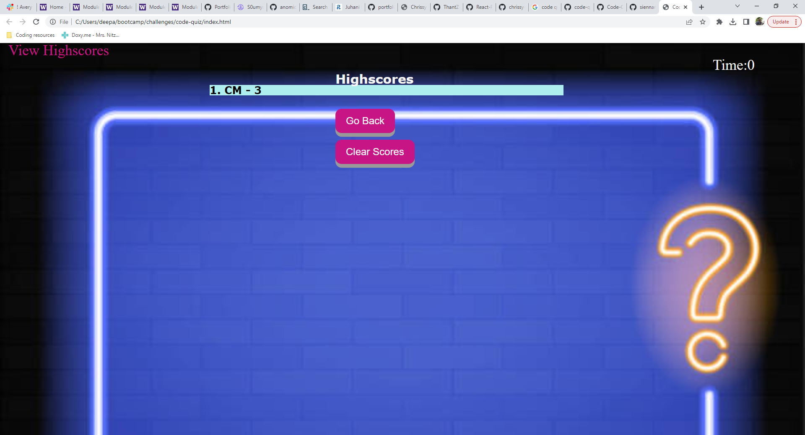

# week-four-challenge
Week 4 challenge for UW boot camp: Code quiz

## Description
This is a multiple choice coding quiz/assessment. This application features dynamically updated HTML and CSS powered by JavaScript. 
 

## Usage
To use this application, start by clicking on the "Start Quiz" button. From there, read the following questions and click on the button containing the correct answer. You will be notified at the bottom of the question if you have answered it coreectly or not. Once you finish the quiz, you will recieve your final score and a space to enter your initials. Type your initals into the box and click "Submit". You will be brought to the Highscores page and see where you landed in the score board. From there, you may choose to go back to the beginning of the quiz or clear all of the scores. On the mainpage, you may view all of the highscores by clicking "View highscores" in the upper left corner of the screen. 

The deployed application can be found here: https://chrissy-martin.github.io/week-four-challenge/

Click on Start Quiz to begin. You may also choose to view highscores by clicking in the topleft corner.

Read the following questions and use the buttons to answer. 
)
)

You will recieve your final score and a space to enter your initials.
)

Enter your initials.
)

Here you can see where you landed in the score board. From there, you may choose to go back to the beginning of the quiz or clear all of the scores.
)

## License

N/A